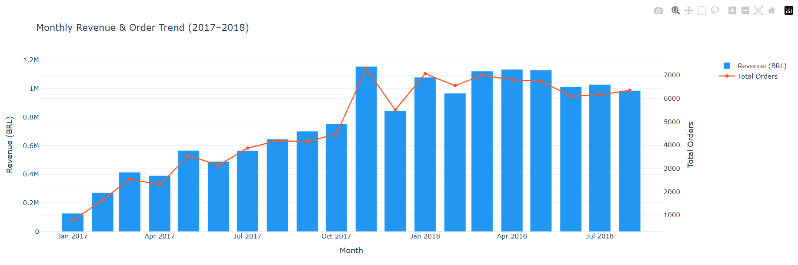

# 🛒 Olist E-Commerce Analytics Dashboard

An end-to-end data analytics pipeline built on the Brazilian E-Commerce dataset by Olist — covering 99K+ orders, 550K+ records across 8 relational tables.

## 📊 Dashboard Preview



---

## 🔍 Business Questions Answered

| # | Business Question | Key Insight |
|---|-------------------|-------------|
| 1 | How has revenue grown over time? | 10x growth from Jan–Nov 2017; Black Friday spike clearly visible |
| 2 | Which categories drive the most revenue? | Health & Beauty is #1 at R$1.2M+ |
| 3 | Which states order the most? | SP dominates with 40K+ orders — 3x more than RJ |
| 4 | How often are deliveries late? | 10.4% avg late rate; AL and MA are worst performers |
| 5 | How do customers prefer to pay? | 73.9% use credit card; boleto accounts for 19% |
| 6 | Which categories get the best reviews? | Books top-rated; small appliances score lowest |
| 7 | Does late delivery hurt review scores? | On-time avg 4.2★ vs Late avg 2.6★ — huge impact |
| 8 | How loyal are customers? | 97% are one-time buyers — major retention opportunity |

---

## 🛠️ Tech Stack

| Layer | Tools |
|-------|-------|
| Database | PostgreSQL 16 |
| Data Loading | Python, Pandas, SQLAlchemy |
| Analysis | SQL (CTEs, window functions, multi-table JOINs) |
| Visualization | Plotly Express, Plotly Graph Objects |
| Dashboard | Plotly Dash |

---

## 📁 Project Structure

```
olist-analytics/
│
├── data/
│   └── raw/                        ← 9 Kaggle CSVs (not committed — download separately)
│
├── sql/
│   ├── schema.sql                  ← PostgreSQL table definitions (8 tables)
│   ├── load_data.py                ← Loads all CSVs into PostgreSQL
│   └── queries/
│       ├── 01_monthly_revenue.sql
│       ├── 02_revenue_by_category.sql
│       ├── 03_orders_by_state.sql
│       ├── 04_delivery_delay.sql
│       ├── 05_payment_methods.sql
│       ├── 06_top_sellers.sql
│       ├── 07_reviews_by_category.sql
│       ├── 08_delay_vs_reviews.sql
│       ├── 09_repeat_customers.sql
│       └── 10_freight_analysis.sql
│
├── notebooks/
│   └── analysis.py                 ← Runs all 10 queries via Python + prints results
│
├── dashboard/
│   ├── charts.py                   ← Exports 9 individual interactive HTML charts
│   └── app.py                      ← Full Plotly Dash dashboard (multi-chart)
│
└── README.md
```

---

## 🚀 How to Run Locally

### Prerequisites
- Python 3.10+
- PostgreSQL 16
- pgAdmin 4 (optional, for visual inspection)

### Step 1 — Clone the repo
```bash
git clone https://github.com/sayali51/olist-ecommerce-analytics.git
cd olist-ecommerce-analytics
```

### Step 2 — Install dependencies
```bash
pip install pandas sqlalchemy psycopg2-binary plotly dash python-dotenv
```

### Step 3 — Download the dataset
Download the [Olist Brazilian E-Commerce Dataset](https://www.kaggle.com/datasets/olistbr/brazilian-ecommerce) from Kaggle and place all 9 CSV files in `data/raw/`.

### Step 4 — Set up PostgreSQL
Create a database named `olist_db` in PostgreSQL, then run the schema:
```bash
psql -U postgres -d olist_db -f sql/schema.sql
```

### Step 5 — Load data
Update credentials in `sql/load_data.py`, then:
```bash
python sql/load_data.py
```

### Step 6 — Launch the dashboard
```bash
python dashboard/app.py
```

Open [http://127.0.0.1:8050](http://127.0.0.1:8050) in your browser.

---

## 📈 Key Findings

- **Revenue grew 10x** between January and November 2017, driven by marketplace expansion and a clear Black Friday spike
- **São Paulo accounts for 42%** of all orders nationally — far ahead of every other state
- **Late deliveries score 2.6★ vs 4.2★** for on-time orders — delivery speed is the single biggest driver of customer satisfaction
- **97% of customers never return** — a loyalty or re-engagement program could significantly improve LTV
- **Health & Beauty + Watches & Gifts** together contribute over 25% of total platform revenue
- **73.9% of payments use credit card** with an average of 3+ installments — buy-now-pay-later behavior is dominant

---

## 🗄️ Database Schema

8 relational tables with 550K+ total rows:

```
customers ──────────────────────────── orders
sellers ─────────────────────────────┐   │
products ──── order_items ───────────┘   │
              order_payments ────────────┘
              order_reviews ────────────┘
product_category_translation
```

---

## 👩‍💻 Author

**Sayali** | Computer Engineering @ SPPU (CGPA 8.92) | AIML Honours

[](https://github.com/sayali51)
